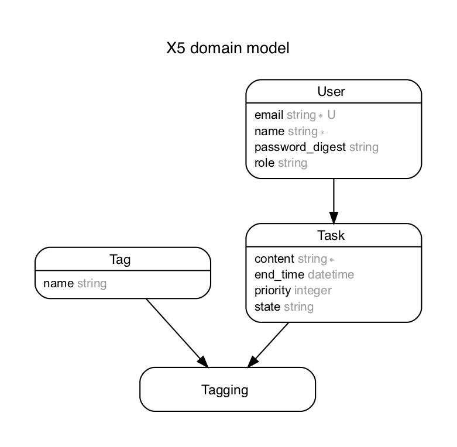

# README

This README would normally document whatever steps are necessary to get the
application up and running.

Things you may want to cover:

* Ruby version

'2.5.3'

* Rails version

'5.2.1'

* Database initialization

```bash
rails db:create
rails db:migrate
```

* How to run the test suite

```bash
rspec
```

## model

* user has many tasks
* task belongs to user
* task has many tags through tagging
* tag has many tasks through tagging

task

* content
* end_at
* priority
* status

user

* name
* email
* password
* role

tag

* name

## ERD

